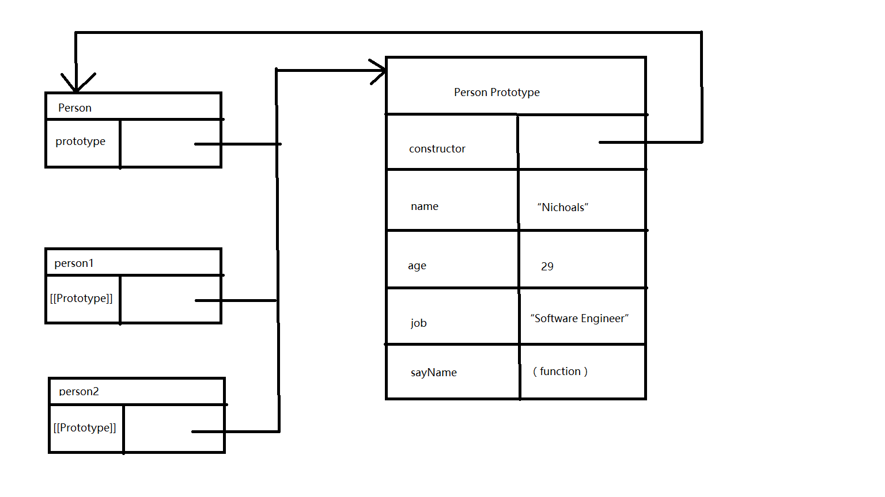

# JavaScript高级程序设计
## 第一章 JavaScript介绍
## 第二章 在HTML中使用JavaScript
## 第三章 基本概念
### 3.1 语法
- 一切(变量,函数名,和操作符)都区分大小写
- 函数名不能使用typeof(关键字),typeOf可以使用
- 标识符(变量 属性 函数的名字或者函数的参数)
    - 第一个字符必须是一个字母/下划线(_)/美元符号($)
    - 其他字符可以是字母,下划线,美元符号或数字
    - 采用驼峰大小写格式
    - 不能把关键字,保留字,true,false,null用作标识符
- 严格模式:为JavaScript定义一种不同的解析与执行模型
    - 支持严格模式的浏览器:IE 10+,Firefox 4+,Safari 5.1+,Oprea 12+,Chrome
```javascript
"use strict"
//编译指示,告诉支持的JavaScript引擎切换到严格模式
```   
- 在函数内部的上方包含这条编译指示,可以指定函数在严格模式下执行:
```javascript
function doSomething () {
    "use strict"
    //函数体
}
```
- 语句:以一个分号结尾;省略分号则由解析器确定语句结尾
### 3.2关键字和保留字
- 关键字:一组有特定用途的**关键字**,用于表示控制语句的开始或结束或用于执行特定操作
```
break     do     instanceof     typeof      case
else      new    var            catch       finally
return    void   continue       debugger    for
switch    while  function       this        with
default   if     throw          delete      in
try
```
- 保留字: 不能用作标识符将来可能作为保留字
```
abstract    enum        int             short       
boolean     export      interface       static
byte        extends     long            super
char        final       native          synchronized
class       float       package         throws
const       goto        private         transient
debugger    implements  protected       volatile
double      import      public
```
- `let`和`yield`
    - `let`:
    - `yield`:ES6新特性;在生成器中,`yield*`可以把需要的yield的值委托给另外一个`生成器`或者其他任意可迭代对象;
    [示例](https://developer.mozilla.org/zh-CN/docs/Web/JavaScript/Reference/Operators/yield*)

    ```javascript
        yield* [[expression]]
        //expression:任意的可迭代对象
    ```
### 3.3 变量
- 变量:用于保存值的占位符,定义时要使用`var`操作符,后跟变量名(标识符)
```javascript
var message;
//保存一个undefined值
var message = "hi";
//定义一个初始值
```
- 如果在函数中使用`var`定义一个变量,这个变量在函数退出后就会被销毁
```javascript
function test() {
    var message = "hi";//局部变量
}
test();
alert(message);//错误
/*
* message是在函数中使用var定义的;
* 当函数被调用的时候,就会创建该变量并为其赋值;
* 调用完成之后,变量会被立即销毁
*/
```
- 省略`var`操作符,创建一个全局变量
```javascript
function test() {
    message = "hi";//全局变量
}
test();
alert(message);//hi
/*
* 省略了var操作符,message就变成为全局的变量
*/
```
- 给未经声明的变量赋值在严格模式下会导致抛出`ReferenceError`错误
- 可以使用一条语句定义多个变量
```javascript
var message = "hi",
    found = false,
    age = 29;
```
- 在严格模式下,不能定义名为`eval`或`arguments`的变量,否则会导致语法错误.
### 3.4 数据类型
- 五种简单数据类型(基本数据类型):`Undefined`,`Null`,`Boolean`,`Number`,`String`
- 复杂类型:`Object` - `Object`本质上是由一组无序的名值对组成
#### 3.4.1 `typeof`操作符(不是函数)
- 用来检测给定变量的数据类型 - `typeof`操作符可能返回下列某个字符串
    - `undefined` - 值未定义
    - `boolean` - 值是布尔值
    - `string` - 值是字符串
    - `number` - 值是数字
    - `object` - 值是对象或null
    - `function` - 值是函数
```javascript
//示例
var message = "some string";
alert(typeof message); //string
alert(typeof (message)); //string
alert(typeof 95); //number
/*
* typeof 操作符 变量/数值字面量
*/
```    
- 通过`typeof`操作符来区分函数和其他对象是有必要的

#### 3.4.2 `undefined`类型
- `Undefined`类型只有一个值,特殊的`undefined`;使用`var`声明但未对其加以初始化时,变量的值是`undefined`
```javascript
var message;
console.log(message == undefined); //true
```
- 对于尚未声明过的变量,会使用`typeof`操作符检测其数据类型(对未经声明的变量调用`delete`不会导致错误,在严格模式下会导致错误)

#### 3.4.3 Null类型
- 第二个只有一个值得数据类型(null);null值表示一个空对象指针
- `undefined`值是派生自`null`值的
```javascript
alert( null == undefined); //true
//位于null和undefined之间的相等操作符总是返回true
```
- 只要意在保存对象的变量还没有真正地保存对象,就应该明确地让该变量保存`null`值

#### 3.4.4 Boolean类型
- 布尔值类型,只有两个字面值:`true`和`false`;区分大小写
- 要将一个值转换为其对应的`Boolean`值,调用`Boolean()`
```javascript
var message = "Hello World"
var messageAsBoolean = Boolean(message);
```
- 数据类型及其对应转换规则
```
数据类型         转换为true的值       转换为false的值
Boolean         true                 false
String          任何非空字符串        ""(空字符串)
Number          任何非零数字          0和NaN
Object          任何对象              null
Undefined       N/A                  undefined
```
- 理解流控制语句(如`if`语句)自动执行相应的布尔值转换

#### 3.4.5 Number类型
- 最基本数值字面量--十进制;而在进行算术计算时,所有的八进制和十六进制表示的数值都会转换成十进制数值
- 1.浮点数值:包含一个小数点
```javascript
var floatNum = 1.1;
```
- 浮点数的最高精度是17位小数,但计算时精度远不及整数
```javascript
var num1 = 0.1 + 0.2;
var num2 = 0.3;
console.log( num1 == num2); //false
```
- 浮点值的计算会产生舍入误差,这是基于`IEEE754`数值的浮点计算通病
- 2。数值范围
- 3。NaN:用于表是一个本来要返回数值的操作数未返回数值的情况(不会抛出错误)
    - 任何涉及`NaN`的操作都会返回`NaN`;
    - `NaN`与任何值都不相等
- `isNaN()`:接受一个任何类型的参数,判断参数是否"不是数值";同样适用于对象
```
基于对象调用 isNaN() =>调用对象的 valueOf() 方法,确定该方法返回的值是否可以转换为数值; 不能,在调用 toString() 再测试返回
```
- 4。数值转换:非数值转换为数值 => Number()/parseInt()/parseFloat();   

## 第六章 面向对象的程序设计
### 6.1 理解对象

#### 6.1.1 属性类型

#### 6.1.2 定义多个属性

### 6.2 创建对象 工厂模式(封装特定接口创建对象) => 构造函数魔术
- `Object`构造函数或对象字面量都可以用来创建单个对象。缺点:使用同一个接口创建很多对象,会产生大量的重复代码。

#### 6.2.1 工厂模式
- 抽象的创建具体对象的过程，用函数来封装以特定接口创建对象的细节
```javascript
function createPerson(name,age,job) {
    var o = new Object();
    o.name = name;
    o.age = age;
    o.job = job;
    o.say = function() {
        console.log("hello");
    };
    return o;
} 

var person1 = createPerson("Jhon",29,"Web Engineer");
```
- 函数`createPerson()`能根据接受的参数来构建一个包含所有必要信息的`Person`对象
- **缺点**：没办法解决对象识别的问题（怎样知道一个对象的类型）

#### 6.2.2 构造函数模式
- 创建自定义构造函数，定义自定义对象类型的属性和方法。
```javascript
//构造函数重写工厂函数
function Person(name,age,job) {
    this.name = name;
    this.age = age;
    this.job = job;
    this.say = function() {
        console.log(this.name);
    };
}

var person1 = new Person("Jhon",29,"Web Engineer");
var person2 = new Person("luffy",21,"caption");
```
- 与工厂函数的不同之处：
    - 没有显示地创建对象；
    - 直接将属性和方法赋给了`this`对象；
    - 没有`return`语句；
- 构造函数始终都应该以一个大写字母开头，非构造函数则应该以一个小写字母开头；
- 要创建`Person`的新实例，必须使用`new`操作符。以`new`方式来调用构造函数共四个步骤：
    - 1.创建一个新对象；
    - 2.将构造函数的作用域赋给新对象（因此`this`指向了这个新对象）；
    - 3.执行构造函数中的代码（为这个新对象添加属性）；
    - 4.返回新对象    
- `person1`和`person2`都保存着`Person`的一个不同的实例，都有一个`constructor`属性，该属性指向`Person`；
- 对象的`constructor`属性是用来标识对象类型（`instanceof`操作符检测）
- 构造函数优于工厂模式原因：构造函数可以将它的实例表示为一种特定的类型。
##### 1.将构造函数当做函数
- 构造函数与其他函数的唯一区别：调用方式。
- 任何函数只要通过`new`操作符调用就可以作为构造函数。而任何函数不通过`new`操作符调用和普通函数没有什么区别。
```javascript
//当作构造函数
var person = new Person("Jhon",29,"Web Engineer");
person.say();
//作为普通函数
Person("Jhon",29,"Web Engineer"); //添加到window
window.say();
//在另一个对象的作用域调用
var o = new Object();
Person.call(o,"Jhon",29,"Web Engineer");
o.say();
```
- 使用`new`创建新对象
- 不使用`new`调用`Person`：属性和方法都被添加到window对象；使用`call`在某个特殊对象的作用域调用函数

##### 2.构造函数的问题
- 主要问题：每个方法都要在每个实例上重新创建一遍。
- 解决办法：ECMAScript的函数是对象，因此每定义一个函数，也就是实例化一个对象
```javascript
function Person() {
    this.name = name;
    this.age = age;
    this.job = job;
    this.sayName = new Function("alert(this.name)");//声明函数在逻辑上是等价的
}
```
- 优势：可以清楚知道每个`Person`实例都包含一个不同的`Function`实例的本质。创建`Function`新实例的机制是相等的；
- 弊端：
    - 1.会导致不同的作用域链和标识符解析，不同实例上的同名函数是不相等的。
    - 2.创建两个完成同样任务的实例。
- 修改之后
```javascript    
function Person() {
    this.name = name;
    this.age = age;
    this.job = job;
    this.sayName = sayName//声明函数在逻辑上是等价的
}

function sayName() {
    alert(this.name);
}

var person1 = new Person("Jhon",29,"Web Engineer");
var person2 = new Person("luffy",21,"caption");
```
- 新问题产生：全局作用域中定义的的函数实际上只能被某个对象调用；如果对象需要定义很多方法，那么就要定义多个全局函数 --- 解决办法： 原型模式

#### 6.2.3 原型模型
- 每一个函数都有一个`prototype`（原型）属性，指向一个对象，用来包含可以由特定类型的所有实例共享的属性和方法。
- `prototype`：可以让所有对象实例共享它所包含的属性和方法。（不必在构造函数中定义对象实例的信息，而可将这些信息直接添加到原型对象中）
```javascript
function Person () {

}

Person.prototype.name = "Nicholas";
Person.prototype.age = 29;
Person.prototype.job = "Software Engineer";
Person.prototype.sayName = function () {
    alert(this.name);
};

var person1 = new Person();
person1.sayName(); //'Nicholas'

var person2 = new Person();
person2.sayName(); //'Nicholas'

alert(person1.sayName === person2.sayName); //true

```
-  `sayName()`方法和所有属性直接添加到`Person`的`prototype`属性，构造函数变成了空函数。也仍然可以通过调用构造函数来创建新对象，新对象还会具有相同的属性和方法。
- 不同的是：新对象的这些属性和方法是有所有实例共享的。

##### 1.理解原型对象
- 只要创建一个新函数，就会根据一组特定的规则为该函数创建一个`prototype`属性，这个属性指向函数的原型对象。默认情况下，所有原型对象都会自动获得一个`constructor`属性（指向`prototype`）属性所在函数的指针。通过构造函数继续为源性对象添加其他属性和方法。
- 创建自定义函数，其原型默认对象只会取得`constructor`属性；其他方法继承自`Object`。当调用构造函数创建一个新实例后，该实力的内部将包含一个指针，指向构造函数的原型。这个指针是（__proto__）对脚本完全是不可见的。这个连接存在于实例与构造函数的原型之间，而不存在与实例与构造函数之间。
- 
- `Person.prototype`指向了原型对象，而`Person.prototype.constructor`又指回了`Person`。原型对象中除了包含`constructor`属性之外，还包括后来添加的其他属性。`Person`的每一个实例`person1`和`person2`都包含一个内部属性，该属性仅仅指向`Person.prototype`。通过 查找对象属性的过程实现对实例所不具有的属性方法的调用
- `[[Prototype]]`指向调用`isPrototypeOf()`方法的对象`(Person.prototype)`,返回`true`。
- ES5新增`Object.getPrototypeOf()`，返回`[[Prototype]]`的值。使用`Object.getPrototypeOf()`可以方便取的一个对象的的原型
- 每当代码读取某个对象的某个属性时，都会执行一次搜索，目标是具有给定名字的属性。搜搜首先从对象实例本身开始。如果在实例中找到了具有给定名字的属性，则返回该属性的值；如果没有找到，则继续搜索指针指向的原型对象，在原型对象中查找具有给定名字的属性。如果在原型对象中找到这个属性，则返回该属性的值。
- *原型最初只包含`constructor`这个属性，该属性是共享的，可以通过对象实例访问*
- 可以通过对象实例访问保存在原型中的值，却不能通过对象实例重写原型中的值。给实例中添加一个属性，该属性与实例原型中的属性同名，则在实例中创建该属性，改属性将会屏蔽原型中的属性。
```javascript
function Person() {

}

Person.prototype.name = "Nichoals";
Person.prototype.age = 29;
Person.prototype.job = "Software Engineer";
Person.prototype.sayName = function () {
    console.log(this.name);
};

var person1 = new Person();
var person2 = new Person();
person1.name = "Greg";
console.log(person1.name); //Greg 来自实例
console.log(person2.name); //Nichoals 来自原型
```
- 当为对象实例添加一个属性时，这个属性就会屏蔽原型对象中保存的同名属性；（添加这个属性只会阻止我们访问原型中的那个属性，但不会修改那个属性，即使将这个属性设置为null，也只会在实例中设置这个属性，而不会恢复其指向原型的连接。
- 使用`delete`操作符可以完全删除实例属性，从而访问原型中的属性。
- 使用`hasOwnPrototype()`方法可以检测一个属性是存在于实例中，还是存在于原型中。指在给定属性存在于对象的实例中时返回`true`。
- *ES5的`Object.getOwnPrototypeDescriptor()`方法只能用于实例属性，要取的原型属性的描述符，必须直接在原型对象上调用`Object.getOwnPrototypeDescriptor()`方法*。
##### 2.原型与`in`操作符
- 两种使用方式：单独使用/`for-in`
    - 单独使用：通过对象能够访问给定属性时返回`true`，无论该属性存在于实例中还是原型中。
```javascript

```    